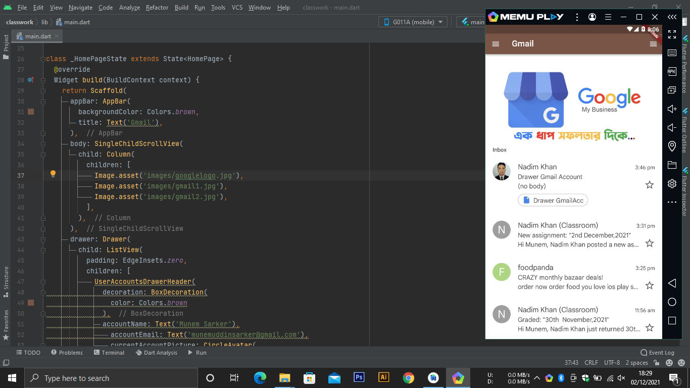
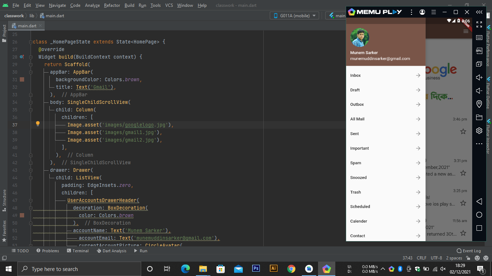
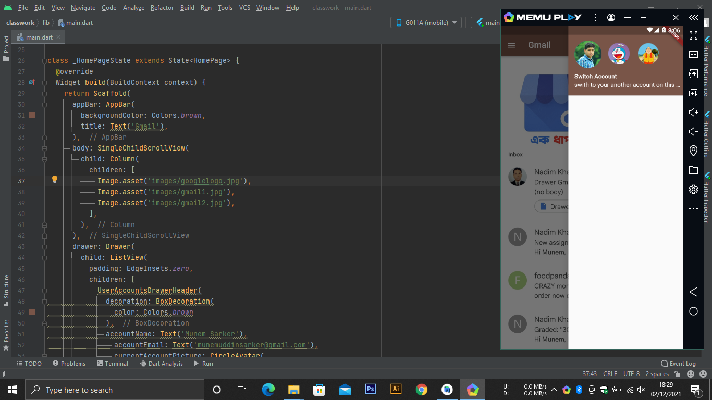

## Make a Drawer app like gmail.

Making a drawer based application like gmail with flutter.

## Screenshots

<table border>
    <tr>
        <th style="text-align:center">Home</th>
        <th style="text-align:center">Main Drawer</th>
        <th style="text-align:center">User accounts</th>
    </tr>
    <tr>
        <td></td>
        <td></td>
        <td></td>
    <tr>
</table>

<table border>

## Getting Started

This project is a starting point for a Flutter application.

If you face any problem with this project or repositories just contact with me on 
- facebook: www.facebook.com/munemuddin.engineer
- instagram: www.instagram.com/munemsarker
